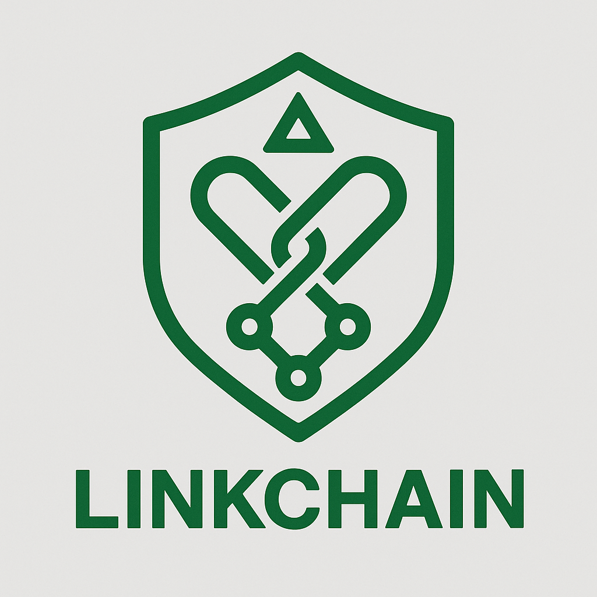

# 🌐 LinkChain: Semantic Search API

A semantic search API built with **FastAPI**, **PostgreSQL + pgvector**, and **LangChain**, powered by sentence-transformers. Designed for fast and intelligent natural language retrieval.



## 🚀 Technologies Used

- 🧠 FastAPI — high-performance Python API framework
- 🗃️ PostgreSQL 16 + pgvector — vector database extension
- 🔤 sentence-transformers — to generate embeddings
- 🔗 LangChain — semantic search and LLM integration
- 🐳 Docker & Docker Compose — containerized deployment

## 📦 Project Structure

```text
.
├── src/                  # Application source code
│   ├── main.py           # FastAPI app with endpoints
│   ├── database.py       # DB connection and vector model
│   ├── embeddings.py     # Embedding generation
│   ├── search.py         # LangChain-powered semantic search
│   └── requirements.txt  # Python dependencies
├── docker/
│   ├── Dockerfile        # FastAPI container build
│   ├── docker-compose.yml # Full environment config
│   └── init.sql          # Enables pgvector extension
├── start.sh              # Startup script
└── README.md             # This file
```

## 🔧 Setup Instructions

```bash
git clone <repo>
cd semantic-search-api
docker compose -f docker/docker-compose.yml up --build
```

📄 Swagger UI available at: [http://localhost:8000/docs](http://localhost:8000/docs)

## 📥 Add Knowledge (Documents)

```bash
curl -X POST http://localhost:8000/documents \
  -H "Content-Type: application/json" \
  -d '{"texts": ["FastAPI is a framework for building APIs in Python"]}'
```

## 🔍 Ask Questions (Semantic Query)

```bash
curl -X POST http://localhost:8000/query \
  -H "Content-Type: application/json" \
  -d '{"question": "What is FastAPI?"}'
```

## 🌐 Endpoints

| Method | Endpoint   | Description                                  |
|--------|------------|----------------------------------------------|
| GET    | /docs      | Swagger UI for API testing                   |
| POST   | /documents | Add documents to the knowledge base          |
| POST   | /query     | Ask questions in natural language (RAG mode) |

## 💡 About the Name: LinkChain

Inspired by *The Legend of Zelda*, **LinkChain** fuses:
🧝‍♂️ *Link*, the legendary seeker of knowledge and truth,
🔗 *LangChain*, the AI framework connecting models and memory.

A tribute to questing for knowledge — through vectors and language.
